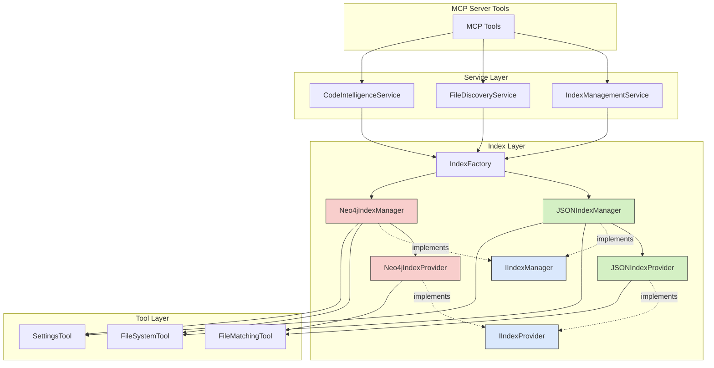
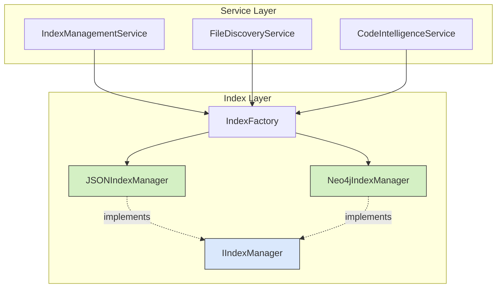

# Implementation Plan

## Overview

This implementation plan addresses the compatibility issues between the Neo4j and JSON index implementations to ensure the Neo4j implementation fully supports all required methods and can be seamlessly used with the MCP server.

The Neo4j implementation currently lacks several required methods and has different initialization behavior compared to the JSON implementation. This plan outlines the necessary changes to make the Neo4j implementation fully compatible with the MCP server tools while maintaining its additional graph database functionality. The goal is to allow users to switch between JSON and Neo4j implementations without any changes to the service layer or MCP tools.

### Current Architecture

The current MCP server architecture follows a layered approach with clear separation of concerns:



#### Key Components:

1. **MCP Server Tools**: The entry points for MCP functionality, exposing capabilities to clients.

2. **Service Layer**:
   - `IndexManagementService`: Manages index lifecycle (rebuilding, status monitoring)
   - `FileDiscoveryService`: Handles file discovery using the index
   - `CodeIntelligenceService`: Provides code analysis and intelligence

3. **Index Layer**:
   - `IndexFactory`: Creates the appropriate index manager based on configuration
   - `IIndexManager`: Interface defining standard index lifecycle management
   - `IIndexProvider`: Interface defining standard index access patterns
   - `JSONIndexManager`: Reference implementation of `IIndexManager`
   - `Neo4jIndexManager`: Neo4j implementation of `IIndexManager` (missing some methods)
   - `JSONIndexProvider`: Reference implementation of `IIndexProvider`
   - `Neo4jIndexProvider`: Neo4j implementation of `IIndexProvider`

4. **Tool Layer**:
   - `FileSystemTool`: Low-level file system operations
   - `FileMatchingTool`: Pattern matching for files
   - `SettingsTool`: Settings management

### Current Flow

The current flow when using the JSON implementation:

1. MCP tools call service layer methods
2. Service layer uses `IndexFactory` to get an index manager
3. `IndexFactory` creates a `JSONIndexManager` instance
4. `JSONIndexManager` initializes when `set_project_path()` is called
5. Service layer uses `JSONIndexManager` methods like `get_index_stats()` and `find_files()`

### Neo4j Implementation Gaps

The Neo4j implementation has these key gaps:

1. **Missing Methods**:
   - `get_index_stats()`: Not implemented in `Neo4jIndexManager`
   - `find_files()`: Not implemented in `Neo4jIndexManager`
   - `save_index()`: Implemented but returns a constant value

2. **Initialization Flow Differences**:
   - `JSONIndexManager` auto-initializes when `set_project_path()` is called
   - `Neo4jIndexManager` requires a separate call to `initialize()` after `set_project_path()`

3. **Method Signature Differences**:
   - `refresh_index()`: Different signature between implementations

## Types

No new types need to be created, but we need to ensure the Neo4j implementation properly implements the existing interfaces.

The key interfaces that must be fully implemented are:
- `IIndexManager`: Defines the standard interface for index lifecycle management
- `IIndexProvider`: Defines the standard interface for index access

The Neo4j implementation must adhere to these interfaces to ensure compatibility with the service layer and MCP tools.

## Files

The following files need to be modified to implement the compatibility plan:

- `src/code_index_mcp/indexing/neo4j_index_manager.py`: Add missing methods and update initialization flow
- `src/code_index_mcp/indexing/index_factory.py`: Update to handle different initialization requirements

No new files need to be created, and no files need to be deleted.

## Functions

### New Functions to Add

1. In `Neo4jIndexManager` class:
   - `get_index_stats()`: Implement to return the same structure as the JSON implementation
   - `find_files()`: Implement to provide the same functionality as the JSON implementation

### Functions to Modify

1. In `Neo4jIndexManager` class:
   - `set_project_path()`: Update to automatically call `initialize()` to match JSON implementation behavior
   - `save_index()`: Enhance to properly save any necessary state
   - `refresh_index()`: Update signature to match JSON implementation

2. In `IndexFactory` class:
   - `create_index_manager()`: Update to ensure consistent initialization regardless of index type

## Classes

### Classes to Modify

1. `Neo4jIndexManager`: Update to fully implement the `IIndexManager` interface
   - Add missing methods
   - Standardize method signatures
   - Update initialization flow

2. `Neo4jIndexProvider`: Ensure it fully implements the `IIndexProvider` interface
   - Review all methods to ensure they match the interface
   - Ensure return data structures are compatible with the JSON implementation

No new classes need to be created, and no classes need to be removed.

## Dependencies

No new dependencies are required for this implementation. The existing dependencies are sufficient:

- `neo4j`: For Neo4j database connectivity
- Standard Python libraries: `os`, `logging`, `threading`, etc.

## Testing

The testing approach will focus on ensuring the Neo4j implementation works correctly with the service layer and MCP tools:

1. Unit Tests:
   - Test each method in `Neo4jIndexManager` to verify it implements the interface correctly
   - Test the initialization flow to ensure it matches the JSON implementation
   - Test the factory to ensure it creates and initializes the correct index manager

2. Integration Tests:
   - Test the Neo4j implementation with the service layer
   - Verify that switching between JSON and Neo4j implementations works seamlessly
   - Test error handling and recovery

3. End-to-End Tests:
   - Test MCP tools with the Neo4j implementation
   - Verify that all functionality works correctly with both implementations

## Implementation Order

The implementation should follow this logical sequence to minimize conflicts and ensure successful integration:

1. Implement the missing methods in `Neo4jIndexManager`:
   - Add `get_index_stats()` method
   ```python
   def get_index_stats(self) -> Dict[str, Any]:
       """Get statistics about the current index."""
       with self._lock:
           if not self.driver:
               return {"status": "not_loaded"}
           
           try:
               status = self.get_index_status()
               
               return {
                   "status": "loaded" if status.get("status") == "available" else "not_loaded",
                   "project_path": status.get("project_path", self.project_path),
                   "indexed_files": status.get("file_count", 0),
                   "total_symbols": status.get("symbol_count", 0),
                   "symbol_types": {
                       "class": status.get("class_count", 0),
                       "function": status.get("function_count", 0)
                   },
                   "languages": status.get("languages", []),
                   "index_version": status.get("index_version", "unknown"),
                   "timestamp": status.get("timestamp", "unknown")
               }
                   
           except Exception as e:
               logger.error(f"Error getting index stats: {e}")
               return {"status": "error", "error": str(e)}
   ```

   - Add `find_files()` method
   ```python
   def find_files(self, pattern: str = "*") -> List[str]:
       """Find files matching a pattern."""
       with self._lock:
           if not self.index_provider:
               logger.warning("Index provider not initialized")
               return []
           
           return self.index_provider.search_files(pattern)
   ```

   - Enhance `save_index()` method
   ```python
   def save_index(self) -> bool:
       """Save index state."""
       # Neo4j index is automatically saved in the database, but we should
       # save any configuration or state that might be needed
       with self._lock:
           try:
               self._save_neo4j_config()
               return True
           except Exception as e:
               logger.error(f"Failed to save Neo4j configuration: {e}")
               return False
   ```

2. Standardize method signatures in `Neo4jIndexManager`:
   - Update `refresh_index()` to match JSON implementation
   ```python
   def refresh_index(self) -> bool:
       """Refresh the index."""
       with self._lock:
           if not self.index_builder:
               logger.error("Index builder not initialized")
               return False
           
           try:
               logger.info("Refreshing Neo4j index...")
               return self.index_builder.build_index(
                   run_clustering=getattr(self, 'clustering_enabled', True),
                   k=getattr(self, 'clustering_k', 5)
               )
                   
           except Exception as e:
               logger.error(f"Failed to refresh index: {e}")
               return False
   ```

3. Update the initialization flow in `Neo4jIndexManager`:
   - Modify `set_project_path()` to automatically call `initialize()`
   ```python
   def set_project_path(self, project_path: str) -> bool:
       """Set the project path and initialize index storage."""
       with self._lock:
           success = super().set_project_path(project_path)
           if success:
               # Auto-initialize after setting project path to match JSON implementation behavior
               return self.initialize()
           return False
   ```

4. Update the factory integration:
   - Enhance `create_index_manager()` to handle different initialization requirements
   ```python
   @staticmethod
   def create_index_manager(index_type: Optional[str] = None) -> IIndexManager:
       """
       Create an index manager of the specified type.
       
       Args:
           index_type: Type of index manager to create (json or neo4j)
           
       Returns:
           An index manager instance
       """
       # If no index type specified, try to get from environment
       if not index_type:
           index_type = os.environ.get(INDEX_TYPE_ENV_VAR, DEFAULT_INDEX_TYPE)
       
       # Create the appropriate index manager
       if index_type.lower() == NEO4J_INDEX_TYPE:
           logger.info("Creating Neo4j index manager")
           return get_neo4j_index_manager()
       else:
           logger.info("Creating JSON index manager")
           return get_json_index_manager()
   ```

5. Add comprehensive error handling and logging:
   - Ensure all methods properly handle errors and provide meaningful error messages
   - Add appropriate logging to aid in debugging

6. Write unit tests for all changes:
   - Test each modified method
   - Test the initialization flow
   - Test the factory integration

7. Write integration tests:
   - Test with the service layer
   - Test with MCP tools

8. Document the changes:
   - Update docstrings
   - Add comments explaining the compatibility changes

### Impact on Service Layer

The changes will ensure that the service layer can work with either implementation without modification:



After implementation, both `JSONIndexManager` and `Neo4jIndexManager` will fully implement the `IIndexManager` interface, allowing the service layer to work with either implementation transparently.
