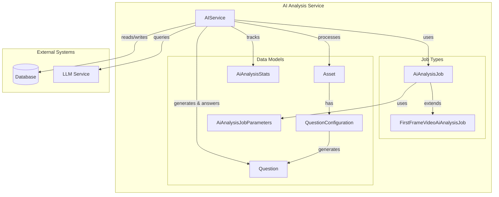
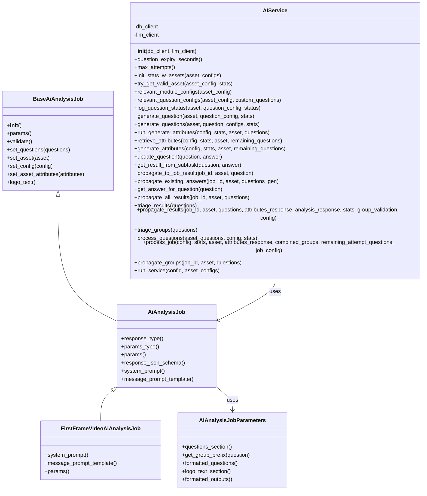
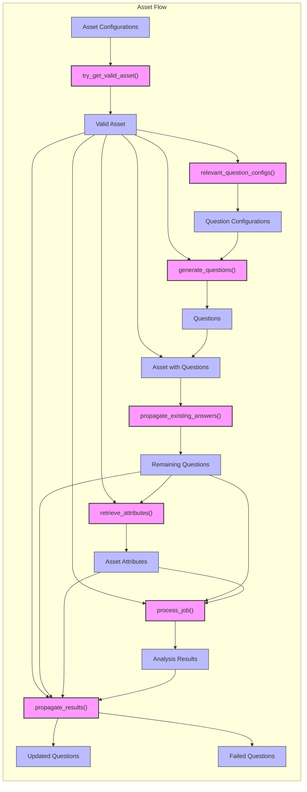
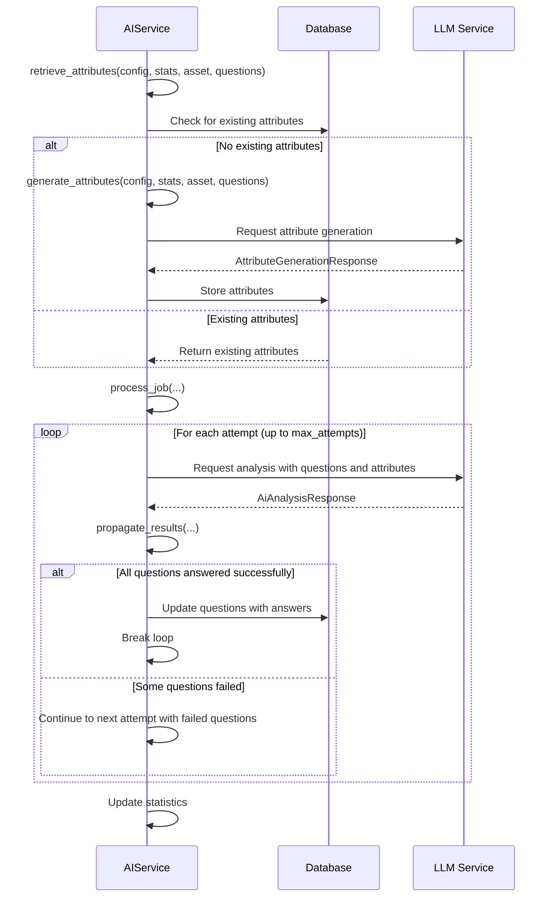

```mermaid
flowchart TD
    subgraph "Question Generation Flow"
        generate_questions["generate_questions(asset, question_configs, stats)"]
        
        generate_questions --> for_each_config["For each question_config"]
        
        for_each_config --> check_group["Check if question is part of a group"]
        check_group -- "Not in group" --> generate_single["generate_question(asset, question_config, stats)"]
        check_group -- "In group" --> handle_group["Handle grouped questions"]
        
        handle_group --> check_group_answers["Check if any question in group lacks answer"]
        check_group_answers -- "All have answers" --> keep_all["Keep all answers"]
        check_group_answers -- "Some missing answers" --> reset_all["Reset all questions in group"]
        
        reset_all --> generate_group["Generate questions for all in group"]
        generate_group --> group_questions["Grouped Questions"]
        
        generate_single --> check_db["Check database for existing question"]
        check_db -- "New question" --> new_q["Create new question"]
        check_db -- "Existing question" --> check_expiry["Check if question is expired"]
        
        check_expiry -- "Not expired" --> has_answer["Check if has answer"]
        check_expiry -- "Expired" --> clear_answer["Clear answer and mark as expired"]
        
        has_answer -- "Has answer" --> keep_answer["Keep existing answer"]
        has_answer -- "No answer" --> mark_new["Mark as new question"]
        
        new_q --> log_status["log_question_status(asset, question_config, 'new')"]
        clear_answer --> log_status_expired["log_question_status(asset, question_config, 'expired')"]
        keep_answer --> log_status_answered["log_question_status(asset, question_config, 'answered')"]
        
        log_status --> update_stats["Update stats (new_questions += 1)"]
        log_status_expired --> update_stats_expired["Update stats (expired_questions += 1)"]
        log_status_answered --> update_stats_answered["Update stats (answered_questions += 1)"]
        
        update_stats --> yield_question["Yield question"]
        update_stats_expired --> yield_question
        update_stats_answered --> yield_question
        
        yield_question --> for_each_config
    end
    
    classDef process fill:#f9f,stroke:#333,stroke-width:2px;
    classDef decision fill:#ffd,stroke:#333,stroke-width:1px;
    classDef action fill:#dff,stroke:#333,stroke-width:1px;
    
    class generate_questions,generate_single,generate_group process;
    class check_group,check_group_answers,check_db,check_expiry,has_answer decision;
    class new_q,clear_answer,keep_answer,mark_new,log_status,log_status_expired,log_status_answered,update_stats,update_stats_expired,update_stats_answered,yield_question,keep_all,reset_all action;
```

# AI Analysis Service: Detailed Flow Diagrams

## 1. High-Level System Overview

This diagram shows the main components of the AI Analysis Service and their relationships:



## 2. Main Service Flow

This diagram details the main flow through the AIService's run_service method:

```mermaid
flowchart TD
    start([Start]) --> run_service["run_service(config, asset_configs)"]
    
    run_service --> init_stats["init_stats_w_assets(asset_configs)"]
    init_stats --> stats["AiAnalysisStats object"]
    
    run_service --> asset_loop["For each asset_config in asset_configs"]
    
    asset_loop --> try_get_valid_asset["try_get_valid_asset(asset_config, stats)"]
    try_get_valid_asset -- "if valid" --> valid_asset["Valid Asset"]
    try_get_valid_asset -- "if invalid" --> skip_asset["Skip asset"]
    skip_asset --> asset_loop
    
    valid_asset --> relevant_question_configs["relevant_question_configs(asset_config, custom_questions)"]
    relevant_question_configs --> question_configs["Question Configurations"]
    
    valid_asset --> generate_questions["generate_questions(asset, question_configs, stats)"]
    question_configs --> generate_questions
    generate_questions --> questions["Questions for Asset"]
    
    valid_asset --> asset_questions["Asset with Questions"]
    questions --> asset_questions
    
    asset_questions --> asset_loop
    
    asset_loop -- "all assets processed" --> process_questions["process_questions(asset_questions, config, stats)"]
    
    process_questions --> final_stats["Final Statistics"]
    final_stats --> end([End])
    
    classDef process fill:#f9f,stroke:#333,stroke-width:2px;
    classDef data fill:#bbf,stroke:#333,stroke-width:1px;
    classDef control fill:#fbb,stroke:#333,stroke-width:1px;
    
    class run_service,init_stats,try_get_valid_asset,relevant_question_configs,generate_questions,process_questions process;
    class stats,valid_asset,question_configs,questions,asset_questions,final_stats data;
    class start,end,asset_loop,skip_asset control;
```

## 3. Question Generation and Management

This diagram shows how questions are generated and managed:



## 4. Question Processing and LLM Integration

This diagram details how questions are processed using the LLM:



```mermaid
flowchart TD
    subgraph "Question Processing Flow"
        process_questions["process_questions(asset_questions, config, stats)"]
        
        process_questions --> for_each_asset["For each (asset, questions) pair"]
        
        for_each_asset --> propagate_existing["propagate_existing_answers(job_id, asset, questions)"]
        propagate_existing --> remaining_questions["Remaining questions without answers"]
        
        remaining_questions -- "if empty" --> next_asset["Move to next asset"]
        next_asset --> for_each_asset
        
        remaining_questions -- "if not empty" --> retrieve_attributes["retrieve_attributes(config, stats, asset, remaining_questions)"]
        retrieve_attributes --> check_db_attributes["Check database for attributes"]
        
        check_db_attributes -- "Attributes exist" --> use_existing_attributes["Use existing attributes"]
        check_db_attributes -- "No attributes" --> generate_attributes["generate_attributes(config, stats, asset, remaining_questions)"]
        
        generate_attributes --> invoke_llm_attributes["Invoke LLM for attribute generation"]
        invoke_llm_attributes --> attributes_response["AttributeGenerationResponse"]
        
        use_existing_attributes --> attributes_response
        
        attributes_response --> attempt_loop["For attempt in range(max_attempts)"]
        
        attempt_loop --> process_job["process_job(config, stats, asset, attributes_response, ...)"]
        process_job --> invoke_llm_analysis["Invoke LLM for analysis"]
        
        invoke_llm_analysis --> analysis_response["AiAnalysisResponse"]
        analysis_response --> propagate_results["propagate_results(job_id, asset, questions, ...)"]
        
        propagate_results --> failed_questions["Questions that failed validation"]
        failed_questions -- "if empty" --> update_stats_success["Update stats (success)"]
        failed_questions -- "if not empty" --> next_attempt["Try next attempt"]
        
        next_attempt --> attempt_loop
        
        update_stats_success --> for_each_asset
    end
    
    classDef process fill:#f9f,stroke:#333,stroke-width:2px;
    classDef decision fill:#ffd,stroke:#333,stroke-width:1px;
    classDef data fill:#bbf,stroke:#333,stroke-width:1px;
    classDef llm fill:#fbb,stroke:#333,stroke-width:2px;
    
    class process_questions,propagate_existing,retrieve_attributes,generate_attributes,process_job,propagate_results process;
    class remaining_questions,check_db_attributes,failed_questions decision;
    class attributes_response,analysis_response data;
    class invoke_llm_attributes,invoke_llm_analysis llm;
```

## 5. Result Propagation Flow

This diagram shows how results are propagated back to the database:

```mermaid
flowchart TD
    subgraph "Result Propagation Flow"
        propagate_results["propagate_results(job_id, asset, questions, attributes, analysis_response, stats, group_validation, config)"]
        
        propagate_results --> update_stats["Update stats with token usage"]
        
        propagate_results --> check_valid["Check if analysis_response is valid"]
        check_valid -- "Invalid" --> return_all["Return all questions as failed"]
        
        check_valid -- "Valid" --> process_answers["Process answers in response"]
        
        process_answers --> for_each_question["For each question"]
        
        for_each_question --> find_answer["Find answer in response"]
        find_answer -- "Answer found" --> update_question["Update question with answer"]
        find_answer -- "No answer" --> mark_failed["Mark question as failed"]
        
        update_question --> check_subtasks["Check if question has subtasks"]
        check_subtasks -- "Has subtasks" --> get_subtask_result["get_result_from_subtask(...)"]
        check_subtasks -- "No subtasks" --> next_question["Process next question"]
        
        get_subtask_result --> update_subtask["Update question with subtask result"]
        update_subtask --> next_question
        
        next_question --> for_each_question
        
        for_each_question -- "All questions processed" --> check_group_validation["Check if group validation is enabled"]
        
        check_group_validation -- "Enabled" --> validate_groups["triage_groups(questions)"]
        validate_groups --> failed_groups["Questions in failed groups"]
        
        check_group_validation -- "Disabled" --> empty_failed["No failed questions"]
        
        failed_groups --> return_failed["Return failed questions"]
        empty_failed --> return_failed
        
        return_failed --> end([End])
        return_all --> end
    end
    
    classDef process fill:#f9f,stroke:#333,stroke-width:2px;
    classDef decision fill:#ffd,stroke:#333,stroke-width:1px;
    classDef action fill:#dff,stroke:#333,stroke-width:1px;
    
    class propagate_results,process_answers,get_subtask_result,validate_groups process;
    class check_valid,check_subtasks,check_group_validation,find_answer decision;
    class update_stats,update_question,mark_failed,update_subtask,return_failed,return_all action;
```

## 6. Job Types and Parameters

This diagram shows the relationship between different job types and their parameters:



## 7. Asset and Question Data Flow

This diagram shows how assets and questions flow through the system:



## 8. LLM Interaction Detail

This diagram details the interaction with the LLM service:



## 9. Complete System Architecture

This final diagram shows the complete system architecture with all components and their interactions:

```mermaid
flowchart TD
    subgraph "AI Analysis Service System"
        subgraph "Service Layer"
            AIService["AIService"]
            
            subgraph "Core Methods"
                run_service["run_service()"]
                process_questions["process_questions()"]
                process_job["process_job()"]
                propagate_results["propagate_results()"]
            end
            
            subgraph "Helper Methods"
                init_stats["init_stats_w_assets()"]
                try_get_valid_asset["try_get_valid_asset()"]
                relevant_question_configs["relevant_question_configs()"]
                generate_questions["generate_questions()"]
                generate_question["generate_question()"]
                retrieve_attributes["retrieve_attributes()"]
                generate_attributes["generate_attributes()"]
                propagate_existing_answers["propagate_existing_answers()"]
                triage_groups["triage_groups()"]
                get_result_from_subtask["get_result_from_subtask()"]
            end
        end
        
        subgraph "Job Layer"
            BaseAiAnalysisJob["BaseAiAnalysisJob"]
            AiAnalysisJob["AiAnalysisJob"]
            FirstFrameVideoAiAnalysisJob["FirstFrameVideoAiAnalysisJob"]
        end
        
        subgraph "Data Models"
            Asset["Asset"]
            Question["Question"]
            AiAnalysisStats["AiAnalysisStats"]
            QuestionConfiguration["QuestionConfiguration"]
            AiAnalysisJobParameters["AiAnalysisJobParameters"]
            AttributeGenerationResponse["AttributeGenerationResponse"]
            AiAnalysisResponse["AiAnalysisResponse"]
        end
    end
    
    subgraph "External Systems"
        Database[(Database)]
        LLM["LLM Service"]
    end
    
    %% Service Layer Connections
    AIService --> run_service
    run_service --> init_stats
    run_service --> try_get_valid_asset
    run_service --> relevant_question_configs
    run_service --> generate_questions
    run_service --> process_questions
    
    process_questions --> propagate_existing_answers
    process_questions --> retrieve_attributes
    retrieve_attributes --> generate_attributes
    process_questions --> process_job
    
    process_job --> propagate_results
    propagate_results --> triage_groups
    propagate_results --> get_result_from_subtask
    
    generate_questions --> generate_question
    
    %% Job Layer Connections
    BaseAiAnalysisJob --> AiAnalysisJob
    AiAnalysisJob --> FirstFrameVideoAiAnalysisJob
    AiAnalysisJob --> AiAnalysisJobParameters
    
    %% Data Model Connections
    Asset --> QuestionConfiguration
    QuestionConfiguration --> Question
    generate_attributes --> AttributeGenerationResponse
    process_job --> AiAnalysisResponse
    
    %% External System Connections
    AIService <--> Database
    AIService <--> LLM
    
    %% Data Flow
    Asset --> try_get_valid_asset
    QuestionConfiguration --> relevant_question_configs
    Question --> generate_questions
    Question --> propagate_existing_answers
    Question --> retrieve_attributes
    Question --> process_job
    Question --> propagate_results
    
    AiAnalysisStats --> init_stats
    AiAnalysisStats --> try_get_valid_asset
    AiAnalysisStats --> generate_questions
    AiAnalysisStats --> process_questions
    AiAnalysisStats --> propagate_results
    
    classDef service fill:#f9f,stroke:#333,stroke-width:2px;
    classDef method fill:#dff,stroke:#333,stroke-width:1px;
    classDef job fill:#ffd,stroke:#333,stroke-width:1px;
    classDef data fill:#bbf,stroke:#333,stroke-width:1px;
    classDef external fill:#fbb,stroke:#333,stroke-width:2px;
    
    class AIService service;
    class run_service,process_questions,process_job,propagate_results,init_stats,try_get_valid_asset,relevant_question_configs,generate_questions,generate_question,retrieve_attributes,generate_attributes,propagate_existing_answers,triage_groups,get_result_from_subtask method;
    class BaseAiAnalysisJob,AiAnalysisJob,FirstFrameVideoAiAnalysisJob job;
    class Asset,Question,AiAnalysisStats,QuestionConfiguration,AiAnalysisJobParameters,AttributeGenerationResponse,AiAnalysisResponse data;
    class Database,LLM external;
```



These diagrams provide a comprehensive view of the AI Analysis Service, capturing the flow of data, the relationships between components, and the key processes involved in analyzing assets using LLMs. The diagrams range from high-level overviews to detailed process flows, giving a complete picture of how the service works.

<attempt_completion>
<result>
# AI Analysis Service: Detailed Flow Diagrams

I've created a series of detailed mermaid diagrams that capture different aspects of the AI Analysis Service flow. Each diagram focuses on a specific part of the system to provide a comprehensive understanding of how the service processes assets, generates and answers questions using LLMs, and manages the results.

## 1. High-Level System Overview

This diagram shows the main components of the AI Analysis Service and their relationships:


## 2. Main Service Flow

This diagram details the main flow through the AIService's run_service method:

```mermaid
flowchart TD
    start([Start]) --> run_service["run_service(config, asset_configs)"]
    
    run_service --> init_stats["init_stats_w_assets(asset_configs)"]
    init_stats --> stats["AiAnalysisStats object"]
    
    run_service --> asset_loop["For each asset_config in asset_configs"]
    
    asset_loop --> try_get_valid_asset["try_get_valid_asset(asset_config, stats)"]
    try_get_valid_asset -- "if valid" --> valid_asset["Valid Asset"]
    try_get_valid_asset -- "if invalid" --> skip_asset["Skip asset"]
    skip_asset --> asset_loop
    
    valid_asset --> relevant_question_configs["relevant_question_configs(asset_config, custom_questions)"]
    relevant_question_configs --> question_configs["Question Configurations"]
    
    valid_asset --> generate_questions["generate_questions(asset, question_configs, stats)"]
    question_configs --> generate_questions
    generate_questions --> questions["Questions for Asset"]
    
    valid_asset --> asset_questions["Asset with Questions"]
    questions --> asset_questions
    
    asset_questions --> asset_loop
    
    asset_loop -- "all assets processed" --> process_questions["process_questions(asset_questions, config, stats)"]
    
    process_questions --> final_stats["Final Statistics"]
    final_stats --> end([End])
    
    classDef process fill:#f9f,stroke:#333,stroke-width:2px;
    classDef data fill:#bbf,stroke:#333,stroke-width:1px;
    classDef control fill:#fbb,stroke:#333,stroke-width:1px;
    
    class run_service,init_stats,try_get_valid_asset,relevant_question_configs,generate_questions,process_questions process;
    class stats,valid_asset,question_configs,questions,asset_questions,final_stats data;
    class start,end,asset_loop,skip_asset control;
```

## 3. Question Generation and Management

This diagram shows how questions are generated and managed:


## 4. Question Processing and LLM Integration

This diagram details how questions are processed using the LLM:

```mermaid
flowchart TD
    subgraph "Question Processing Flow"
        process_questions["process_questions(asset_questions, config, stats)"]
        
        process_questions --> for_each_asset["For each (asset, questions) pair"]
        
        for_each_asset --> propagate_existing["propagate_existing_answers(job_id, asset, questions)"]
        propagate_existing --> remaining_questions["Remaining questions without answers"]
        
        remaining_questions -- "if empty" --> next_asset["Move to next asset"]
        next_asset --> for_each_asset
        
        remaining_questions -- "if not empty" --> retrieve_attributes["retrieve_attributes(config, stats, asset, remaining

```